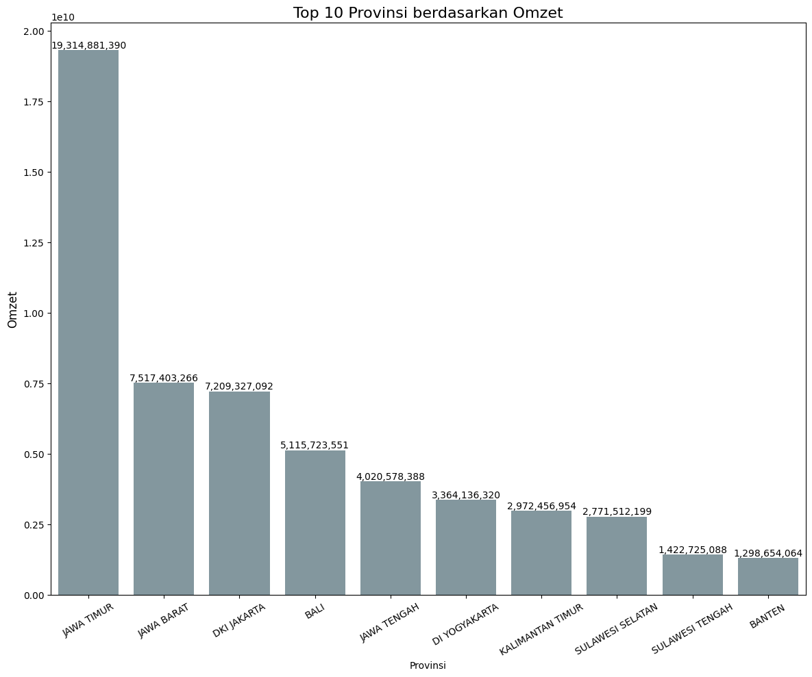
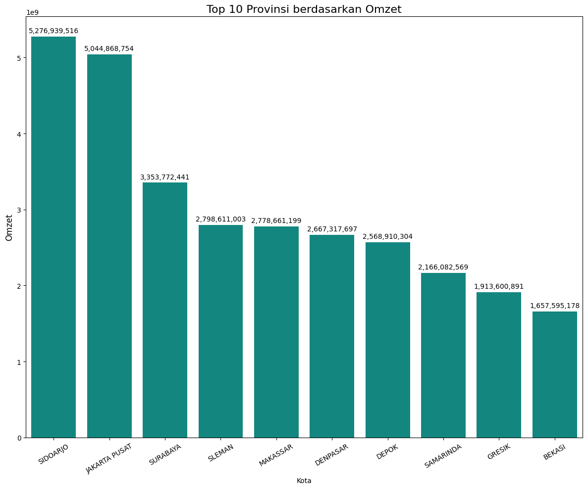
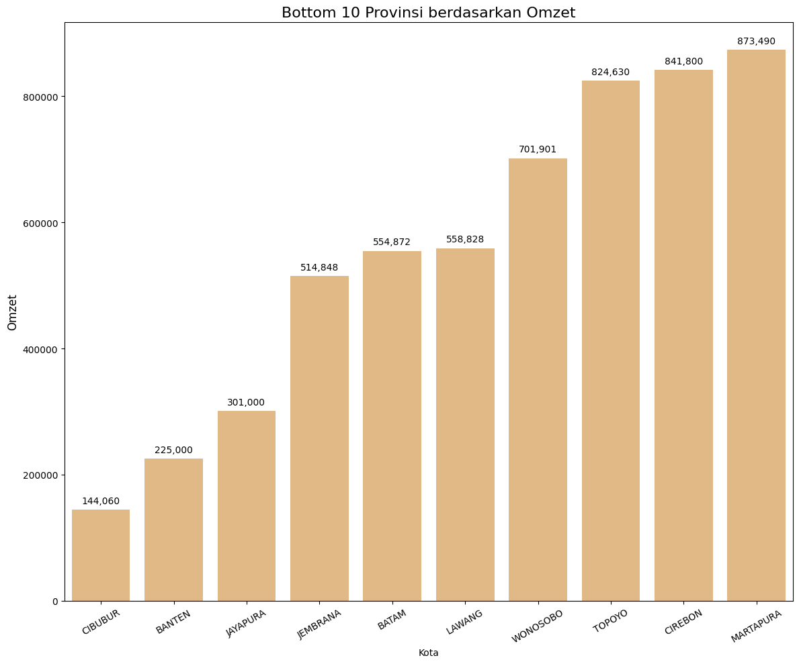
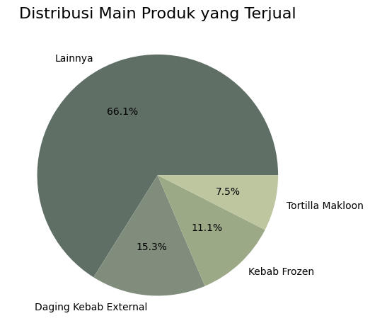
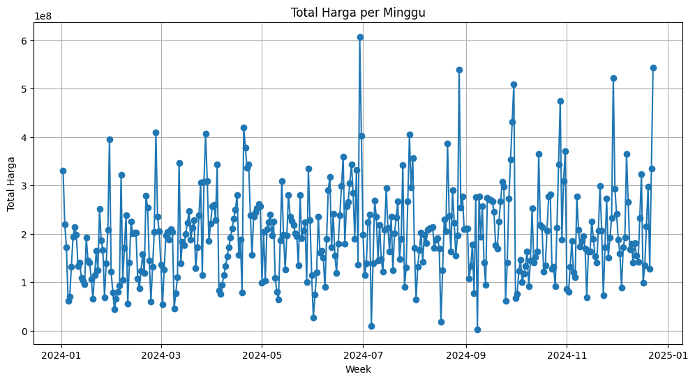
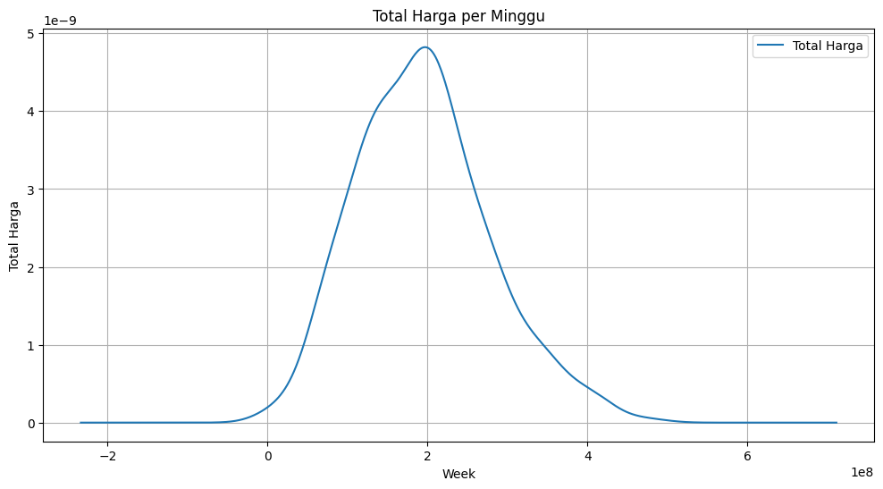
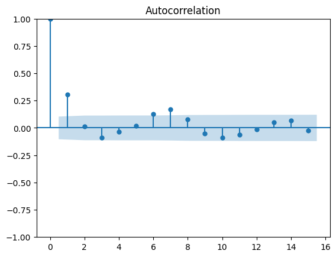
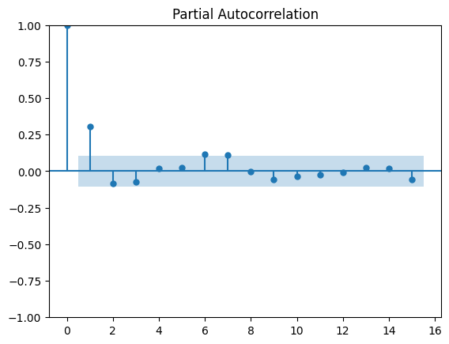
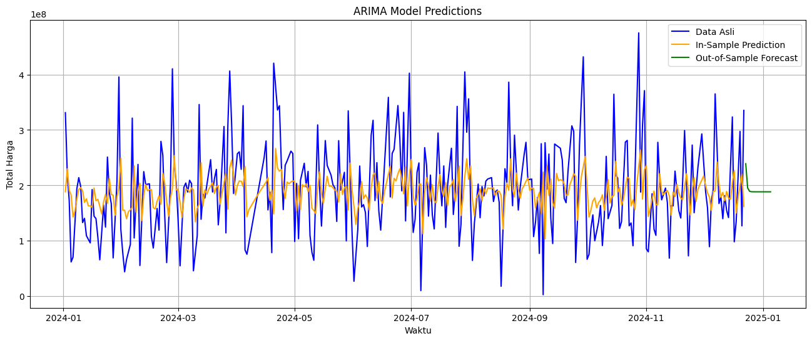

# Interpretasi dan Insight dari Forecasting ARIMA

Dokumen ini merangkum analisis, interpretasi, dan insight yang diekstrak dari `Forecast_Arima_Anonymized.ipynb`.

## 1. Exploratory Data Analysis (EDA)

### **Pendapatan berdasarkan Provinsi dan Kota**

- **Provinsi Teratas:** **Jawa Timur** adalah pemimpin mutlak dalam pendapatan penjualan (Omzet), menghasilkan sekitar **Rp 19,3 Miliar** dengan lebih dari 748.000 unit terjual. Diikuti oleh **Jawa Barat** (~Rp 7,5 Miliar), **DKI Jakarta** (~Rp 7,2 Miliar), dan **Bali** (~Rp 5,1 Miliar).

- **Distribusi Tingkat Kota:** Distribusi pendapatan di berbagai kota menunjukkan konsentrasi tinggi di beberapa pusat utama (misalnya, Bali, Bandar Lampung). 10 kota terbawah sangat kontras dengan menunjukkan traksi yang sangat rendah, menyoroti area potensial untuk pemasaran lokal atau optimalisasi distribusi seiring waktu.

### **Pendapatan berdasarkan Produk Utama**

- **Produk Dominan:** **Tortilla** adalah kategori terlaris secara luar biasa, menghasilkan **Rp 24,7 Miliar** (lebih dari 1,18 juta unit terjual).
- **Produk Sekunder:** **Daging Kebab External** (~Rp 6,4 Miliar) dan **Kebab Frozen** (~Rp 4,6 Miliar) menjadi aliran pendapatan terbesar berikutnya.
- **Insight:** Bisnis sangat bergantung pada produk intinya (Tortilla). Memastikan stabilitas rantai pasok untuk Tortilla sangat penting, karena merupakan mayoritas besar dari kue distribusi pendapatan.

---

## 2. Persiapan Data Deret Waktu (Time-Series)

- **Agregasi:** Dataset dikelompokkan secara berkelanjutan berdasarkan `Date` (frekuensi harian) yang dipetakan ke `Total Harga` (Pendapatan Harian). Entri harian yang hilang diisi menggunakan interpolasi linier untuk menghindari diskontinuitas.

- **Penanganan Outlier:** Lonjakan pendapatan yang melebihi **Z-Score 3** (misalnya, penjualan besar pada 29 Juni 2024, atau 23 Desember 2024) difilter, diganti dengan `NaN`, dan dihaluskan menggunakan interpolasi linier. Hal ini mencegah pesanan massal ekstrem yang mungkin anomali mengganggu varians Forecasting.

---

## 3. Uji Normalitas & Stasioneritas

- **Uji Normalitas:** Data pendapatan harian awalnya gagal dalam uji Shapiro-Wilk (p-value = 0,001 < 0,05) dan menunjukkan distribusi miring ke kanan (right-skewed).

- **Transformasi Box-Cox:** Untuk menstabilkan varians dan menormalkan data, transformasi Box-Cox diterapkan (Optimal $\lambda \approx 0,672$). Setelah transformasi, data lolos uji normalitas Shapiro-Wilk (p-value = 0,851).
- **Stasioneritas:**
  - **Uji ADF (Augmented Dickey-Fuller):** P-value sebesar 0,000 (< 0,05), mengonfirmasi bahwa deret yang ditransformasi tidak memiliki unit root dan sepenuhnya stasioner.
  - **Uji KPSS:** P-value sebesar 0,048 (< 0,05) menunjukkan sedikit ketidakstasioneran di sekitar tren deterministik.
  
  
  
  - Mengingat stasioneritas yang kuat dari uji ADF, model dilanjutkan tanpa differencing yang berat (`d=0`).

---

## 4. Pemodelan & Evaluasi ARIMA

Deret pendapatan harian yang telah ditransformasi dibagi secara temporal (80% Latih, 20% Uji).

### **Hyperparameter Tuning**
Grid search dievaluasi pada $p \in [0, 3]$, $d \in [0]$, dan $q \in [0, 3]$ untuk menemukan hyperparameter yang meminimalkan RMSE dan MSE.
- **Model Terbaik:** **ARIMA(6, 0, 5)** menghasilkan metrik kesalahan terendah (berdasarkan iterasi model yang lebih mendalam dalam notebook).
  - RMSE Terendah: ~145.671 (dalam skala Box-Cox)
  - MSE Terendah: ~21.220.135.141 (dalam skala Box-Cox)
- Model standar dasar **ARIMA(1, 0, 1)** divisualisasikan secara singkat, tetapi grid search memverifikasi bahwa memperhitungkan hingga 6 lag sebelumnya (AR=6) dan 5 error rata-rata bergerak (MA=5) menangkap fluktuasi harian sedikit lebih baik.

### **Pembuatan Forecast**

- **Insight:** Dengan memanfaatkan parameter `d=0` dan normalisasi melalui Box-Cox, model ARIMA memberikan Forecasting yang stabil dan cenderung kembali ke nilai rata-rata (mean-reverting). Meskipun berhasil menetapkan ekspektasi dasar untuk pendapatan harian, model ini secara alami menghaluskan lonjakan harian yang tidak menentu, berfungsi sebagai tolok ukur jangka pendek yang konservatif daripada prediktor yang sangat fluktuatif.
